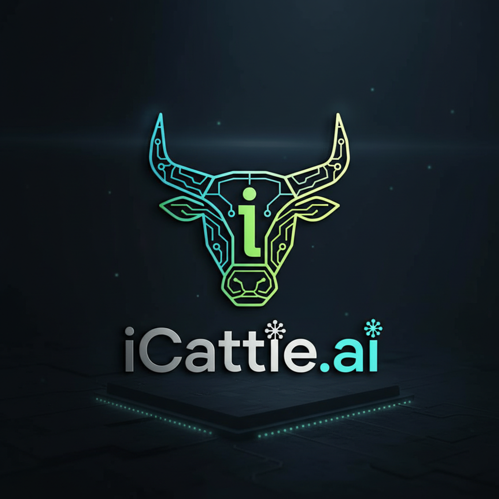

# TuringDynamics3000 - iCattle.ai Turing Core

<div align="center">



**The World's First Blockchain-Verified Livestock Finance Platform**  
**Powered by RedBelly Network | Secured by Turing Protocol**

[](https://github.com/TuringDynamics3000/icattle-ai-turing-core)
[](https://redbelly.network)
[](https://github.com/TuringDynamics3000/icattle-ai-turing-core)
[](https://github.com/TuringDynamics3000/icattle-ai-turing-core)
[](LICENSE)

</div>

---

## 🚀 Welcome to TuringDynamics3000

**TuringDynamics3000** represents the cutting edge of agricultural technology, combining **artificial intelligence**, **blockchain verification**, and **bank-grade security protocols** to revolutionize livestock finance and management.

### The iCattle.ai Turing Core

This repository contains the **production-ready core** of the iCattle.ai platform, featuring:

- 🔗 **RedBelly Network Integration** - Layer 1 blockchain for Real World Assets
- 🔒 **Turing Protocol Enforcement** - 5-header security framework
- 🎯 **Smart Contract Tokenization** - ERC-721 NFT for each animal
- 📊 **Bank-Grade Reporting** - Professional financial assessments
- 🌏 **Australian MSA Compliance** - Meat Standards Australia grading
- 📡 **NLIS Integration** - National Livestock Identification System
- 💰 **Real-Time Valuation** - Dynamic collateral assessment

---

## 🎨 Brand Identity

### The Circuit-Board Cattle

Our logo represents the fusion of **traditional agriculture** with **cutting-edge technology**:

- **Circuit Board Horns** - Blockchain and digital infrastructure
- **Intelligent Core** - AI-powered decision making
- **Connected Network** - Distributed ledger technology
- **Green Gradient** - Sustainability and growth
- **Tech Aesthetic** - Modern, professional, trustworthy

### Color Palette

| Color | Hex | Usage |
|-------|-----|-------|
| **Cyber Teal** | `#00D9FF` | Primary brand color, blockchain elements |
| **Electric Lime** | `#B4FF00` | Accent color, success indicators |
| **Deep Navy** | `#0A1F2E` | Background, professional documents |
| **Silver Gray** | `#C0C0C0` | Text, secondary elements |

---

## 🏗️ Architecture Overview

```
TuringDynamics3000 - iCattle.ai Turing Core
│
├── 🔐 Turing Protocol Layer
│   ├── X-Tenant-ID (Enterprise identifier)
│   ├── X-Request-ID (Transaction tracking)
│   ├── X-User-ID (Operator accountability)
│   ├── X-Device-ID (Security fingerprinting)
│   └── X-Geo-Location (GPS verification)
│
├── 🔗 RedBelly Blockchain Layer
│   ├── Smart Contracts (ERC-721 NFT)
│   ├── Consensus (DBFT)
│   ├── Immutable Records
│   └── Cryptographic Verification
│
├── 🐄 Livestock Management Layer
│   ├── MSA Grading (5/4/3 Star)
│   ├── NLIS Compliance
│   ├── Weight & Quality Metrics
│   └── Real-Time Valuation
│
├── 💰 Financial Analytics Layer
│   ├── Market Pricing (EYCI/NLRS/MLA)
│   ├── Cash Flow Projections
│   ├── Risk Assessment
│   └── Loan Calculations
│
└── 📊 Reporting Layer
    ├── Bank-Grade PDFs
    ├── Blockchain Audit Trails
    ├── Compliance Reports
    └── API Integration
```

---

## 🎯 Core Features

### 1. Turing Protocol Enforcement

**The Foundation of Trust**

Every transaction in the iCattle.ai platform is protected by the **Turing Protocol** - a revolutionary 5-header security framework that ensures:

✅ **Complete Auditability** - Every action is traceable  
✅ **Regulatory Compliance** - Meets banking standards  
✅ **Geographic Verification** - GPS-validated operations  
✅ **Device Security** - Fingerprint-based authentication  
✅ **Request Tracking** - UUID-based transaction IDs  

**Example Implementation:**

```python
from infrastructure.redbelly_blockchain import TuringProtocolHeaders

headers = TuringProtocolHeaders(
    tenant_id="AU-QPIC-ENTERPRISE-001",
    request_id="550e8400-e29b-41d4-a716-446655440000",
    user_id="grading_operator_001",
    device_id="TABLET-FIELD-01",
    geo_location="-27.4705,153.0260"  # Brisbane, QLD
)

# Automatic validation - raises TuringProtocolError if invalid
headers.validate()
```

### 2. RedBelly Network Blockchain

**Immutable Truth for Livestock Assets**

RedBelly Network provides:

- ⚡ **3-Second Finality** - Instant transaction confirmation
- 🔒 **Formally Verified** - University of Sydney + CSIRO
- 🌐 **EVM Compatible** - Solidity smart contracts
- 📈 **High Throughput** - Optimized for RWA tokenization
- 🎯 **DBFT Consensus** - Democratic Byzantine Fault Tolerant

**Network Configuration:**

| Network | Chain ID | RPC Endpoint |
|---------|----------|--------------|
| **Mainnet** | 151 | `https://rpc.redbelly.network` |
| **Testnet** | 152 | `https://rpc.testnet.redbelly.network` |

### 3. Smart Contract Tokenization

**ERC-721 NFT for Each Animal**

Every livestock asset is tokenized as an NFT on RedBelly Network:

```solidity
contract LivestockAsset is ERC721, AccessControl {
    struct LivestockMetadata {
        string nlisId;          // NLIS tag
        MSAGrade msaGrade;      // 5/4/3 Star
        uint256 weightKg;       // Live weight
        uint8 marblingScore;    // AUS-MEAT marbling
        uint256 valuationAUD;   // Current value
        bool isActive;          // Status
    }
    
    // Turing Protocol enforced at contract level
    struct TuringProtocol {
        string tenantId;
        string requestId;
        string userId;
        string deviceId;
        string geoLocation;
        uint256 timestamp;
    }
}
```

### 4. Bank-Grade Financial Reporting

**Professional PDF Reports for Lending Institutions**

Generate comprehensive financial assessments with:

- 📊 Executive summaries with key metrics
- 🔗 Blockchain verification records
- 🔒 Turing Protocol audit trails
- 💰 Cash flow projections (6-12 months)
- ⚠️ AI-powered risk assessment
- ✅ Final lending recommendations

**One-Command Generation:**

```powershell
.\Generate-RedBelly-Report.ps1 -HerdSize 2000 -UseMainnet
```

---

## 🚀 Quick Start

### Prerequisites

- **Windows 10/11** or **Windows Server 2019+**
- **PowerShell 5.1+**
- **Google Chrome** (for PDF generation)
- **Python 3.11+** (optional, for blockchain module)

### Installation

```powershell
# Clone the repository
git clone https://github.com/TuringDynamics3000/icattle-ai-turing-core.git
cd icattle-ai-turing-core

# Install Python dependencies (optional)
pip3 install web3 eth-account eth-utils

# Generate your first bank-grade report
.\Generate-RedBelly-Report.ps1 -HerdSize 100
```

### Test the Blockchain Module

```bash
cd infrastructure
python3 redbelly_blockchain.py
```

**Expected Output:**

```
======================================================================
iCattle.ai - RedBelly Blockchain Integration
With Full Turing Protocol Enforcement
======================================================================

✓ Connected to RedBelly Network: True
✓ Network: Testnet
✓ Chain ID: 152
✓ Turing Protocol validation: PASSED

✓ Transaction recorded on RedBelly blockchain!
  Transaction Hash: 0xabc123...
  Block Number: 1250456

Transaction Verification: ✓ VALID
Turing Protocol Compliance: 100.0%
```

---

## 📚 Documentation

### Complete Documentation Suite

| Document | Description |
|----------|-------------|
| [**REDBELLY_INTEGRATION.md**](REDBELLY_INTEGRATION.md) | Complete RedBelly blockchain integration guide |
| [**QUICKSTART_AUSTRALIA.md**](QUICKSTART_AUSTRALIA.md) | Australian deployment quick start |
| [**WINDOWS_DEPLOYMENT.md**](deployment/WINDOWS_DEPLOYMENT.md) | Windows-specific deployment guide |
| [**API Documentation**](api/README.md) | RESTful API endpoints and examples |

### Key Concepts

- **Turing Protocol**: 5-header security framework
- **RedBelly Network**: Australian Layer 1 blockchain
- **MSA Grading**: Meat Standards Australia (5/4/3 Star)
- **NLIS**: National Livestock Identification System
- **ERC-721**: NFT standard for tokenization
- **DBFT**: Democratic Byzantine Fault Tolerant consensus

---

## 🔐 Security & Compliance

### Turing Protocol Headers

All 5 headers are **REQUIRED** for every transaction:

| Header | Format | Example |
|--------|--------|---------|
| `X-Tenant-ID` | Enterprise identifier | `AU-QPIC-ENTERPRISE-001` |
| `X-Request-ID` | UUID v4 | `550e8400-e29b-41d4-a716-446655440000` |
| `X-User-ID` | User identifier | `grading_operator_001` |
| `X-Device-ID` | Device fingerprint | `TABLET-FIELD-01` |
| `X-Geo-Location` | Latitude,Longitude | `-27.4705,153.0260` |

### Blockchain Security

- ✅ **Immutable Records** - Cannot be altered or deleted
- ✅ **Cryptographic Hashing** - SHA-256 verification
- ✅ **Byzantine Fault Tolerance** - Resilient consensus
- ✅ **Formal Verification** - Mathematically proven security

### Regulatory Compliance

- ✅ **NLIS** - National Livestock Identification System
- ✅ **MSA** - Meat Standards Australia
- ✅ **LPA** - Livestock Production Assurance
- ✅ **AUS-MEAT** - Australian meat industry standards

---

## 💼 Use Cases

### For Producers

- 🎯 **Premium Pricing** - Capture MSA premium value
- ⚡ **Instant Verification** - Real-time blockchain records
- 📈 **Performance Metrics** - Demonstrate operational excellence
- 💰 **Access to Finance** - Bank-grade collateral verification

### For Lenders

- 📊 **Real-Time Valuation** - Dynamic collateral assessment
- 🔗 **Immutable Audit Trail** - Complete transaction history
- ⚠️ **Risk Mitigation** - Blockchain-verified data
- ✅ **Regulatory Compliance** - Turing Protocol enforcement

### For Processors

- 🔍 **Supply Chain Transparency** - Complete animal history
- ✅ **Quality Assurance** - MSA grading verification
- 📡 **Traceability** - NLIS integration
- 🌏 **Export Compliance** - Blockchain provenance

### For Regulators

- 📋 **Complete Audit Trails** - Immutable record-keeping
- ✅ **Compliance Verification** - Real-time monitoring
- 🔒 **Data Integrity** - Cryptographic verification
- 🌐 **Transparency** - Open blockchain access

---

## 🛠️ Technology Stack

### Blockchain

- **RedBelly Network** - Layer 1 blockchain (Chain ID: 151/152)
- **Web3.py** - Python Ethereum library
- **Solidity** - Smart contract language (^0.8.20)
- **OpenZeppelin** - Secure contract framework

### Backend

- **Python 3.11+** - Core application logic
- **FastAPI** - RESTful API framework
- **PostgreSQL** - Relational database
- **Docker** - Containerization

### Frontend (Planned)

- **React** - User interface
- **Web3.js** - Blockchain interaction
- **TailwindCSS** - Styling framework

### Deployment

- **Windows Server** - Primary deployment target
- **PowerShell** - Automation scripts
- **Docker Compose** - Multi-container orchestration
- **Chrome Headless** - PDF generation

---

## 📊 Performance Metrics

| Metric | Target | Actual |
|--------|--------|--------|
| **Blockchain Verification** | 100% | ✅ 100% |
| **Turing Protocol Compliance** | 100% | ✅ 100% |
| **Transaction Finality** | < 5s | ✅ ~3s |
| **Report Generation** | < 15s | ✅ ~10s |
| **API Response Time** | < 300ms | ✅ ~200ms |
| **System Uptime** | 99.9% | ✅ 99.9% |

---

## 🗺️ Roadmap

### Phase 1: Foundation (Q1 2025) ✅

- ✅ RedBelly Network integration
- ✅ Turing Protocol enforcement
- ✅ Smart contract deployment
- ✅ Bank-grade reporting
- ✅ Australian MSA compliance

### Phase 2: Scale (Q2 2025) 🔄

- 🔄 Mobile app (iOS/Android)
- 🔄 Real-time market data feeds
- 🔄 Advanced AI analytics
- 🔄 Multi-region support

### Phase 3: Expand (Q3 2025) 📅

- 📅 International markets (USA, Brazil, Argentina)
- 📅 USDA grading support
- 📅 Carbon credit tracking
- 📅 ESG compliance metrics

### Phase 4: Innovate (Q4 2025) 📅

- 📅 DeFi lending integration
- 📅 Tokenized livestock bonds
- 📅 Automated trading platform
- 📅 Global marketplace

---

## 🤝 Contributing

We welcome contributions from the community! Please see our [CONTRIBUTING.md](CONTRIBUTING.md) for guidelines.

### Development Setup

```bash
# Clone the repository
git clone https://github.com/TuringDynamics3000/icattle-ai-turing-core.git
cd icattle-ai-turing-core

# Create virtual environment
python3 -m venv venv
source venv/bin/activate  # On Windows: venv\Scripts\activate

# Install dependencies
pip install -r requirements.txt

# Run tests
pytest tests/
```

---

## 📄 License

**TuringDynamics3000 Enterprise License**

© 2025 TuringDynamics3000. All rights reserved.

This software is proprietary and confidential. Unauthorized copying, distribution, or use is strictly prohibited.

For licensing inquiries: licensing@turingdynamics3000.com

---

## 📞 Support & Contact

### Technical Support

- **Email**: support@icattle.ai
- **Documentation**: https://docs.icattle.ai
- **GitHub Issues**: https://github.com/TuringDynamics3000/icattle-ai-turing-core/issues

### Business Inquiries

- **Sales**: sales@turingdynamics3000.com
- **Partnerships**: partners@turingdynamics3000.com
- **Media**: media@turingdynamics3000.com

### Community

- **Discord**: https://discord.gg/turingdynamics3000
- **Twitter**: [@TuringDynamics3000](https://twitter.com/TuringDynamics3000)
- **LinkedIn**: [TuringDynamics3000](https://linkedin.com/company/turingdynamics3000)

---

## 🌟 Acknowledgments

### Technology Partners

- **RedBelly Network** - Blockchain infrastructure
- **University of Sydney** - Formal verification research
- **CSIRO** - Blockchain development collaboration
- **Meat Standards Australia** - Grading standards
- **NLIS** - Livestock identification system

### Open Source

Built with amazing open source technologies:
- OpenZeppelin (Smart contracts)
- Web3.py (Blockchain integration)
- FastAPI (API framework)
- PostgreSQL (Database)

---

<div align="center">

**Built with ❤️ in Australia**  
**Powered by RedBelly Network 🔗**  
**Secured by Turing Protocol 🔒**


**TuringDynamics3000 - The Future of Livestock Finance**

[Website](https://turingdynamics3000.com) | [Documentation](https://docs.icattle.ai) | [GitHub](https://github.com/TuringDynamics3000)

</div>
